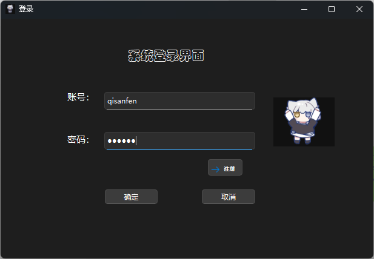
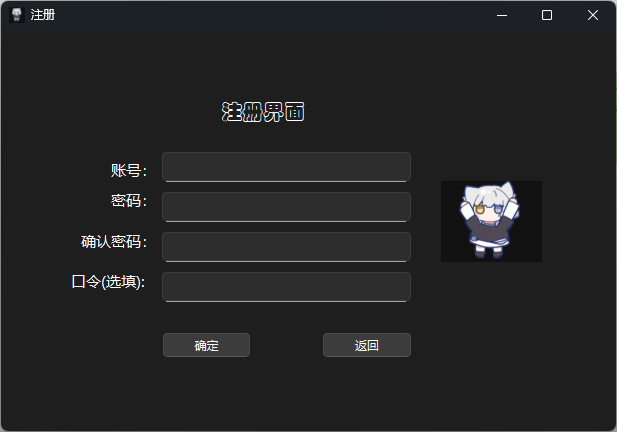
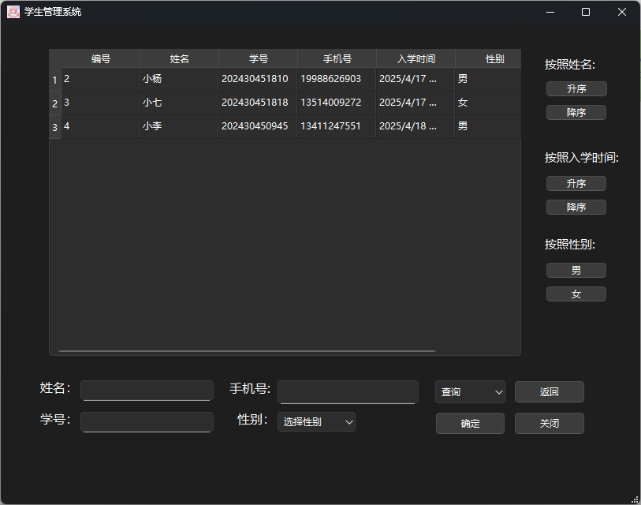

# myWork

### 关于本项目

​	这是我的**大一C++课大作业**,实现了一个简单的**高校学生信息管理系统**(Information Management System),

#### 技术栈

- 基本语言:c++	

- GUI框架:QT
- 数据库:Mysql, ODBC

#### 功能

- 账号管理: 可进行不同**用户注册**和**登录**操作

- 权限控制: 分为**管理员**(教师)权限和**普通用户**(学生)权限, 教师端允许对数据进行增删改查操作,学生端仅允许查询操作.
- 操作菜单: 通过菜单选择用户当前输入的数据要进行的操作.
- 查询数据: 查询可通过**姓名**或**学号**特定查询(需补全), 姓名不唯一, 学号唯一, 默认查询所有学生信息. 同时提供对数据分别按照姓名或入学时间升序或降序排序, 以及男女分组操作.
- 增删改: 需输入完整信息:姓名,学号,性别,手机号. 入学时间由数据添加的时刻决定.


### 数据库表结构

```sql
#账号表
CREATE TABLE account(
	account varchar(30) not null primary key comment "账号",
    password varchar(30) not null comment "密码",
    level char(1) not null comment "权限等级"
)

#学生信息表
CREATE TABLE student(
	id int not null auto_increment primary key comment "学生编号",
    name varchar(255) not null comment "姓名",
    stuId varchar(255) not null unique comment "学号",
    phone varchar(255) not null unique comment "手机号",
    joinTime datatime default current_timestamp comment "入学时间",
    gender char(1) not null comment "性别"
)
```


### 效果展示




​	


